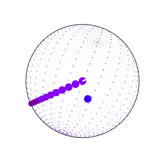

# Spherical Snake - Agent

A reinforcement learning agent trained to play Snake on the surface of a sphere using **Proximal Policy Optimization (PPO)**. The agent learns entirely from self-play in a custom [Gymnasium](https://gymnasium.farama.org/) environment with no hand-crafted heuristics.

**[▶ Watch the agent play live in your browser](https://luxter.github.io/SphericalSnakeAgent/)**
**[▶ Explanation and training video](https://www.youtube.com/watch?v=zIj5vRliYkY)



---

## Highlights

- **Custom 3D environment** - Snake physics on a unit sphere, implemented from scratch in Python (`src/agent/env.py`) with exact correspondence to a JavaScript game renderer.
- **Compact observation space** - 21-dimensional float32 vector: pellet bearing (sin/cos + distance) and 18 collision-detection whiskers at 20° intervals covering the full 360° around the head.
- **PPO training** - Stable-Baselines3 PPO with 16 parallel `SubprocVecEnv` workers, batch size 4096, trained for up to 400M environment steps.
- **Curriculum learning** - Early training episodes spawn pellets near the snake's head to bootstrap body-avoidance behaviour before switching to uniform random placement.
- **Reward shaping** - Sparse +1 on eat, −10 on self-collision, with a small progress term (Δgreat-circle distance) and a time penalty to discourage circling.
- **Visualisation pipeline** - Agent traces are recorded in Python, replayed through the JS renderer via Node.js, and exported as GIFs for side-by-side comparison across training checkpoints.

## Training

```bash
# Default: 400M steps, 16 envs
python -m agent.train

# With curriculum learning (60 near-head pellets per episode initially)
python -m agent.train --curriculum-length 60

# Monitor with TensorBoard
tensorboard --logdir runs/
```

## Visualise a Trained Agent

```bash
# Render all checkpoints for a run to GIF
python tools/agent_trace.py --model runs/PPO_23_curriculum

# Render the best checkpoint only
python tools/agent_trace.py --model runs/PPO_23_curriculum/best/best_model.zip
```

## Deploy to Browser

The trained model is exported to ONNX and embedded as base64 JavaScript so the browser can run inference without a server.

```bash
# Export the best checkpoint to ONNX and generate the embedded JS file
python -m agent.export_onnx runs/PPO_23_curriculum/best/best_model.zip

# Copy the generated JS file to the docs directory
cp runs/PPO_23_curriculum/best/best_model.js docs/agent_model.js
```

The `docs/agent_model.js` file is loaded by `docs/agent.js` at startup. No build step or web server is required — the game and agent run entirely in the browser from a static GitHub Pages deployment.

## License

MIT
